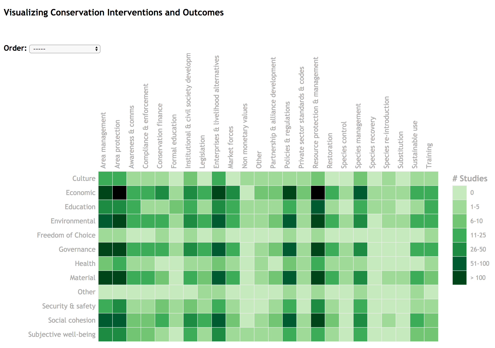

# SNAPP Evidence based - Gaps Heatmap

Codes generated by [NCEAS Scientific computing team](https://www.nceas.ucsb.edu/scicomp) to create an interactive heatmap from bibliographical database created by the [SNAPP Evidence based](http://snappartnership.net/groups/evidence-based-conservation/) working group through systematic review of _nature conservation interventions_ and _outcomes_.

The `D3` Heatmap code: ./heatmap.html

The Bibliography: ./Biblio/

The R codes to generate the necessary masterfile read by the heatmap:

- [**get_dois.R**](./Rscripts/get_dois.R) : `getdoi()` ping the crossref API to find matches to a specific title. It allows by default 5 trials with 5 sec. interval as the API is sometimes not responsive. Require the [`rcrossref`](https://github.com/ropensci/rcrossref) package.
- [**map_dois.R**](./Rscripts/map_dois.R) : relies on `getdoi()` to loop trhough a vector of titles and store the DOI, formatted title, full citation and the original title. Also check if the original title and the formatted title are identical or not. Finally export the results as a csv.
- [**DOI_fuction.R**](./Rscripts/DOI_function.R) :  join the DOIs to the evidence based database to create the file used by the D3 heeatmap to render the heatmap. Also creates the references pages and bibliographic data.

**This interactive heatmap is part of the main data portal Evidence for Nature and People: <http://natureandpeopleevidence.org/ebc-dataportal-current/>**

